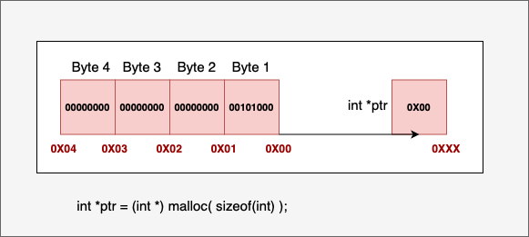

# C-programming-sc

## Pointers

A pointer is a variable whose value is a memory address.


Let `x` be an integer variable defined and initialized to the value 10.

```c
int x = 10;
```

An integer take 4 bytes (32 bits) of memory in a 32-bit or 64-bit system. If we assume the first byte is stored in memory address 0X00 (0th bit) then the last byte will be stored in memory address 0X03 (23rd bit). An integer pointer can store the address of an integer variable.

```c
int *ptr = &x;
```

The result of the unary & operator is a pointer to its operand. The operand shall be an lvalue. -- C++03 standard.

```c 
int i =5;
int *p;

p = &5; // Error, 5 is not an lvalue
p = &i; // OK
```

As the address of the variable **x** starts with address 0X00, the pointer variable **ptr** will have the value 0X00. 

## Pointer Arithmetic


## Memory allocation

| Segment       | Description                                                                        |
|---------------|------------------------------------------------------------------------------------|
| Text segment  | Compiled program code (executable instructions)                                                                      |
| Data segment  | Global variables, static variables.                                                |
| Stack         | Stores local variables, function arguments, and return addresses. Memory is managed automatically by the compiler.                                          |
| Heap          | Used for dynamically allocated memory. Managed by the programmer using library functions (e.g., malloc, free in C; new, delete in C++).




If memory allocation is successful, **malloc** returns a void pointer (void*) to the beginning of the allocated memory block. This pointer can then be cast to the desired type. If memory allocation fails (e.g., not enough memory available), **malloc** returns a NULL pointer.

> **Important:** Always check the return value of **malloc** to ensure allocation was successful before using the pointer. Remember to free memory allocated with **malloc** when it's no longer needed to prevent memory leaks.


## Command-line arguments refresher
## Command-Line Arguments

When a program is executed from the command line, the command interpreter (e.g., `sh`/`bash` in Unix/Linux) parses the command line and passes information to the `main` function as:

- **`argc`** (argument count): An integer representing the number of command-line arguments.  
- **`argv`** (argument vector): An array of C-style strings (`char* argv[]` or `char** argv`), where each string is one of the arguments.

**Example**

```bash
./myprogram arg1 "another arg"
```
In the above commannd line, we have the following layout:

```text
argv:
+-----------+     +---------------------------------------+
| argv[0]   |---->| '.', '/', 'm', 'y', ..., 'm', '\0'    |  (Program name string)
+-----------+     +---------------------------------------+
| argv[1]   |---->| 'a', 'r', 'g', '1', '\0'              |  (First argument string)
+-----------+     +---------------------------------------+
| argv[2]   |---->| 'a', 'n', 'o', 't', ..., 'g', '\0'    |  (Second argument string)
+-----------+     +---------------------------------------+
| argv[3]   |---->  NULL  (This is the NULL pointer terminating the `argv` array itself)
+-----------+
```

In order to provide utilities to users, we can parse the command-line arguments using strcmp:

int strcmp ( const char * str1, const char * str2 );

it returns 0 if the contents of both string matches.

E.g.

if (strcmp(argv[1], 'myflag') == 0 ){
    
}


## File process

The following C functions are used in our practice to process input files

FILE *fopen(const char *filename, const char *mode);

E.g.fopen(inputfile, 'r');

char *fgets(char *str, int n, FILE *stream);

E.g. char buffer[256];
fgets(buffer, sizeof(buffer), fp);


int fscanf(FILE *stream, const char *format, ... );
E.g.  float *b = (float *)malloc(n * sizeof(float));
      for (int i = 0; i < n; i++){
        fscanf(fp, "%f", &b[i]);
      }
